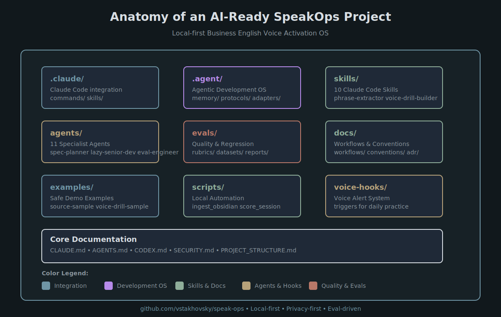
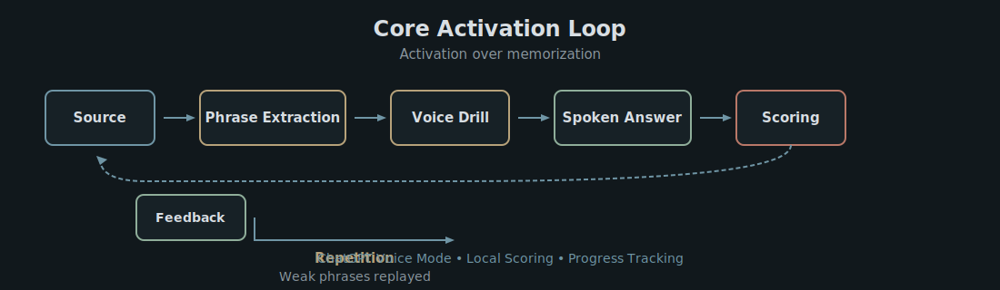

# SpeakOps<div align="center"><p>  <strong>🎤 Local-first Business English Voice Activation OS</strong></p><p>  Transform passive vocabulary into active spoken communication for IT, Product, and AI professionals</p><p align="center">  </p><p>  <em>Anatomy of an AI-Ready Repository • Claude Code Skills • Agents • Evals • Privacy-First</em></p>[Features](#-features) • [Quick Start](#-quick-start) • [Architecture](#-architecture) • [Development](#-development) • [Resources](#-resources)</div>---## Badges<p align="center">                </p>---## Core Activation Loop<p align="center">  </p>**Core principle:** Activation over memorizationThe loop emphasizes practice and feedback over rote memorization:1. **Source Material** → Phrase Extraction2. **Voice Drill** → Spoken Answer (ChatGPT Voice)3. **Scoring** → Feedback4. **Repetition** → Weak phrases replayed in new contexts**Result:** Phrases become active and ready for real meetings and interviews.---### Why SpeakOps ExistsIT, Product, and AI professionals often have **passive** English vocabulary from reading technical blogs, documentation, and conference talks—but struggle to use it actively in spoken contexts like:- 🔸 **Senior PM interviews** — "Tell me about a time you handled stakeholder conflict"- 🔸 **Stakeholder meetings** — "We need to discuss roadmap priorities"- 🔸 **Technical discussions** — "Let's review the system design"- 🔸 **AI/evals conversations** — "How do we evaluate model behavior?"- 🔸 **Executive updates** — "Presenting Q2 achievements"- 🔸 **Conflict and pushback** — "I have concerns about this timeline"**SpeakOps bridges this gap** through systematic voice practice with:- 🎯 **Spoken naturalness filtering** — Rejects written/AI-like phrases, prioritizes natural spoken Business English- 🤖 **Claude Code skills** — Automated phrase extraction, drill building, and scoring- 👥 **Agent-based development** — Specialized agents for quality, security, and review- ✅ **Eval-driven quality** — Every behavior has eval coverage with quality gates- 🔒 **Privacy-first architecture** — Local-only data, no API keys, no external dependencies---## Features### 🎯 Core Capabilities| Capability | Description ||------------|-------------|| **Phrase extraction** | Extract useful Business English phrases from Obsidian, Google Docs, YouTube, NotebookLM || **Naturalness filtering** | Reject formal/written/AI-like phrases, prioritize natural spoken language || **Voice drill generation** | Build ChatGPT Voice prompts for interview and meeting practice || **Activation scoring** | Track phrase activation from passive (0–39) to meeting-ready (90–100) || **Weak phrase replay** | Automatically replay missed or incorrectly-used phrases in new contexts || **Weekly benchmark evals** | Run fixed scenarios to track progress and identify regressions |### 🏗️ Architecture Highlights- **Local-first** — All data stays on your device, no cloud sync- **Privacy-first** — No API keys, no external calls, no telemetry- **Agent-based** — 11 specialized agents for development quality- **Skill-based** — 10 Claude Code skills for reusable workflows- **Eval-driven** — 6 eval rubrics with quality gates- **Convention-based** — Clear documentation for spoken style, extraction, drills, evals---## Architecture### High-Level Overview```┌─────────────────────────────────────────────────────────────┐│                    SpeakOps System                          │├─────────────────────────────────────────────────────────────┤│                                                             ││  ┌──────────────┐    ┌──────────────┐    ┌──────────────┐  ││  │   Sources    │───>│  Phrase      │───>│   Voice      │  ││  │               │    │  Extraction  │    │   Drills     │  ││  │ Obsidian      │    │              │    │              │  ││  │ Google Docs   │    │ ┌──────────┐ │    │ ┌──────────┐ │  ││  │ YouTube       │    │ │Spoken    │ │    │ │ChatGPT   │ │  ││  │ NotebookLM    │    │ │Naturalness│ │    │ │Voice     │ │  ││  │ Meeting notes │    │ │Gate      │ │    │ │Runtime   │  │  ││  └──────────────┘    │ └──────────┘ │    │ └──────────┘ │  ││                     └──────────────┘    └──────────────┘  ││                                                           ││  ┌──────────────┐    ┌──────────────┐    ┌──────────────┐  ││  │  Phrase      │<───│  Activation  │<───│  Weekly      │  ││  │  Cards       │    │  Scoring     │    │  Evals       │  ││  └──────────────┘    └──────────────┘    └──────────────┘  ││                                                           │└─────────────────────────────────────────────────────────────┘```### System Flow (Mermaid)```mermaidflowchart TD    %% Nodes    Source[Source Material]    Source --> Obsidian[Obsidian]    Source --> GDocs[Google Docs]    Source --> YouTube[YouTube]    Source --> Notes[Meeting Notes]    Obsidian --> Extraction[Phrase Extraction]    GDocs --> Extraction    YouTube --> Extraction    Notes --> Extraction    Extraction --> Naturalness[Spoken Naturalness Gate]    Naturalness --> Drills[Voice Drill Builder]    Drills --> ChatGPT[ChatGPT Voice Practice]    ChatGPT --> Session[Spoken Session]    Session --> Scoring[Activation Scoring]    Scoring --> Feedback[Feedback Loop]    Feedback --> PhraseCards[Phrase Cards]    PhraseCards --> WeakPhrases[Weak Phrase Replay]    WeakPhrases --> Drills    Scoring --> Weekly[Weekly Evals]    Weekly --> Quality[Quality Gates]    Quality --> Improvement[Agentic Repo Improvement]    Improvement --> Docs[Documentation Update]    Improvement --> Evals[Evals Update]    Improvement --> Decision[Decision Log]    %% Styling    classDef source fill:#172126,stroke:#6F95A5,stroke-width:2px,color:#D8DEE3    classDef extraction fill:#172126,stroke:#B7A27A,stroke-width:2px,color:#D8DEE3    classDef voice fill:#172126,stroke:#8FAE9A,stroke-width:2px,color:#D8DEE3    classDef quality fill:#172126,stroke:#B97868,stroke-width:2px,color:#D8DEE3    classDef loop fill:#172126,stroke:#B78BEA,stroke-width:2px,color:#D8DEE3    class Source,Obsidian,GDocs,YouTube,Notes source    class Extraction,Naturalness,Drills extraction    class ChatGPT,Session,Scoring,Feedback,PhraseCards voice    class Weekly,Quality,Improvement quality    class WeakPhrases,Docs,Evals,Decision loop```### Component Layers**1. Integration Layer (`.claude/`)**- Commands for Claude Code workflows- Skills bridge to `/skills/` directory- User-facing entry point**2. Development OS (`.agent/`)**- Protocols for coding, eval, review, release- Adapters for Claude Code, ChatGPT Voice- Memory and decision tracking**3. Skills (`skills/`)**- 10 Claude Code skills with evals- Phrase extraction, filtering, drill building- Scoring, replay, weekly evaluation**4. Quality (`evals/`)**- 6 eval rubrics with scoring criteria- Regression testing- Quality gates for all behaviors**5. Documentation (`docs/`)**- User workflows and conventions- Architecture Decision Records- Decision log and changelog---## Quick Start### Prerequisites- [x] Claude Code installed- [x] Python 3.13+- [x] Obsidian (optional)- [x] ChatGPT with Voice Mode (for practice)### Get Started in 3 Steps```bash# 1. Clone repositorygit clone https://github.com/vstakhovsky/speak-opscd speakops# 2. Start Claude Code in repoclaude# 3. Build your first voice drill/build-voice-drill --mode meeting --scenario stakeholder-pushback```### Complete Workflow```bash# Ingest phrases from Obsidian/ingest-obsidian --path "~/ObsidianVault/Phrases"# Extract and filter phrases/extract-phrases --domain stakeholder-pushback --level b2-c1/filter-spoken# Build voice drill/build-voice-drill --mode meeting --scenario stakeholder-pushback# Practice in ChatGPT Voice (copy prompt)# Score session/score-session --summary "[session summary]"# Update phrase bank/update-phrase-bank```---## Repository Structure```speakops/├── README.md                    # This file├── CLAUDE.md                     # Claude Code development guide├── AGENTS.md                     # Agent roles and responsibilities├── CODEX.md                      # Independent reviewer guidelines├── SECURITY.md                   # Security and privacy model├── PROJECT_STRUCTURE.md          # Repository anatomy│├── .claude/                      # Claude Code integration│   ├── commands/                 # Slash commands│   └── skills/                   # Skills bridge│├── .agent/                       # Agentic Development OS│   ├── memory/                   # Working memory, decisions│   ├── protocols/                # Coding, eval, review loops│   └── adapters/                 # Claude Code, ChatGPT Voice│├── skills/                       # Claude Code Skills (primary)│   ├── phrase-extractor/│   ├── spoken-naturalness-gate/│   ├── voice-drill-builder/│   ├── interview-activator/│   ├── meeting-simulator/│   ├── weak-phrase-replayer/│   ├── activation-scorer/│   ├── weekly-eval/│   ├── source-ingestor/│   └── phrase-card-generator/│├── agents/                       # Agent specifications│   ├── spec-planner.md│   ├── repo-architect.md│   ├── skill-architect.md│   ├── voice-flow-designer.md│   ├── spoken-naturalness-judge.md│   ├── eval-engineer.md│   ├── activation-scorer.md│   ├── privacy-security-reviewer.md│   ├── lazy-senior-dev.md│   └── codex-reviewer.md│├── evals/                        # Quality and regression│   ├── rubrics/                  # Scoring rubrics│   ├── datasets/                 # Golden datasets│   ├── expected/                 # Expected outputs│   └── reports/                  # Eval results│├── docs/                         # Documentation│   ├── workflows/                # User workflows│   ├── conventions/               # Development conventions│   ├── adr/                      # Architecture Decision Records│   ├── decision-log.md           # All decisions│   └── changelog.md              # Version history│├── scripts/                      # Automation│   ├── ingest_obsidian.py│   ├── score_session.py│   ├── update_phrase_bank.py│   └── run_evals.py│├── templates/                    # Output templates│   ├── phrase-card.md│   ├── chatgpt-voice-prompt.md│   ├── practice-log.md│   └── weekly-review.md│├── examples/                     # Safe demo examples│   ├── source-sample.md│   ├── phrase-cards-sample.md│   ├── voice-drill-sample.md│   └── scoring-report-sample.md│└── data/                         # Local data (gitignored)    ├── phrases.csv    ├── sessions.jsonl    ├── scores.jsonl    └── weak_phrases.jsonl```---## Skills & Agents### Claude Code Skills| Skill | Purpose ||-------|---------|| **phrase-extractor** | Extract Business English phrases from sources || **spoken-naturalness-gate** | Filter phrases for spoken naturalness || **voice-drill-builder** | Build ChatGPT Voice prompts || **interview-activator** | Build interview simulations || **meeting-simulator** | Build meeting simulations || **weak-phrase-replayer** | Replay weak phrases in new contexts || **activation-scorer** | Score phrase usage from sessions || **weekly-eval** | Run weekly benchmark evals || **source-ingestor** | Ingest source material || **phrase-card-generator** | Create phrase cards |### Development Agents| Agent | Responsibility ||--------|---------------|| **spec-planner** | Convert requests to specs || **repo-architect** | Review repository structure || **skill-architect** | Design Claude Code skills || **voice-flow-designer** | Design voice practice flows || **spoken-naturalness-judge** | Judge phrase naturalness || **eval-engineer** | Create evals for behaviors || **activation-scorer** | Maintain scoring model || **privacy-security-reviewer** | Security/privacy review || **lazy-senior-dev** | Reduce scope and bloat || **codex-reviewer** | Independent reviewer || **docs-architect** | Maintain documentation |---## Evals & Quality Gates### Eval Coverage| Eval Type | Purpose | Pass Threshold ||-----------|---------|---------------|| **Phrase extraction quality** | Phrase extraction | 4/5 || **Spoken naturalness** | Natural language filtering | 4/5 || **Voice drill quality** | Drill prompts | 4/5 || **Activation scoring** | Scoring consistency | 4/5 || **Privacy/security** | Security standards | 4/5 || **Weekly regression** | Regression detection | 4/5 |### Quality GatesBefore merging changes:- ✅ Unit tests if scripts changed- ✅ Evals if skills/prompts changed- ✅ Regression evals if scoring changed- ✅ Privacy/security review if ingestion changed- ✅ Docs update if workflow changed- ✅ Decision log update if architecture changed---## Activation Score ModelEach phrase is scored **0–100** across dimensions:| Dimension | Points | Description ||-----------|--------|-------------|| Meaning understood | 10 | You know what it means || Used without hint | 20 | You used it without being prompted || Correct usage | 20 | Grammatically and contextually correct || Natural spoken usage | 20 | Sounds natural, not written || Context transfer | 15 | Used across different scenarios || Retrieval speed | 10 | Quick access in conversation || Retention after 7+ days | 5 | Still active after a week |**Status levels:**- **0–39:** Passive — Recognize but don't use- **40–59:** Recognized — Can use with effort- **60–74:** Semi-active — Sometimes use naturally- **75–89:** Active — Use comfortably- **90–100:** Meeting-ready / Interview-ready---## Quality Rules### Avoid (Too Formal/Written)❌ "I would like to emphasize..."❌ "It is crucial to note..."❌ "Furthermore..."❌ "Moreover..."❌ Long passive sentences❌ Essay tone### Prefer (Natural Spoken)✅ Short spoken phrases✅ Direct but polite wording✅ Realistic meeting language✅ Business clarity✅ Natural rhythm✅ IT/IT context---## WorkflowsSee `/docs/workflows/` for detailed workflows:1. **Obsidian → Voice Drill** — Obsidian phrase bank to voice drill2. **Google Docs → Voice Drill** — Google Docs phrase list to voice drill3. **YouTube → AI/Evals Pack** — YouTube conference to AI/evals phrase pack4. **Transcript → Scoring** — Voice session to scoring5. **Weekly Benchmark** — Weekly eval to track progress---## DevelopmentSee [CLAUDE.md](CLAUDE.md) for complete development process.### Core Principle> **Feature is not done until it has:**> `spec + implementation + evals + security check + docs + decision log`### Development ProcessFor every meaningful task:1. **Read repository** — Build repo map2. **Create spec** — Problem, scope, metrics, risks3. **Review with agents** — repo-architect, lazy-senior-dev, security-reviewer4. **Implement** — Minimal code that works5. **Add evals** — Quality gates6. **Security review** — Privacy check7. **Codex review** — Independent critique8. **Update docs** — Documentation and decision log### Ponytail Mode**Lazy development principles:**1. Does this need to exist?2. Stdlib does it?3. Native platform feature?4. Already-installed dependency?5. Can it be one line?6. Only then: minimal code**No:**- Unrequested abstractions- Boilerplate "for later"- Over-engineering---## Security & Privacy**Local-first architecture:**- ✅ No API keys stored- ✅ No external network calls without approval- ✅ Source content treated as untrusted- ✅ Minimal data retention- ✅ Private transcripts not logged by default**Data storage:**- ✅ All data stored locally in `/data/`- ✅ User controls data location- ✅ User can delete data anytime- ✅ No cloud storage by default**Privacy guarantee:**- ✅ No telemetry- ✅ No analytics- ✅ No tracking- ✅ Manual source ingestion (MVP)See [SECURITY.md](SECURITY.md) for full security model.---## Examples### Source Material```markdown## Sample: Stakeholder Management Meeting**Mike:** We need to get this feature into Q2. Sales is asking for it daily.**Sarah:** I understand, but I need to push back on that timeline...```### Phrase Card```markdown# push back on**Russian:** возразить против**Context:** Disagreeing with stakeholder requests**Natural:** "I'd push back on that timeline."**Avoid:** "I would respectfully disagree..."```### Voice Drill Prompt```markdownYou are the VP of Sales. I am a PM.**Scenario:** You're pushing for a feature that Engineering says is too complex.**Target phrases:** push back on, loop in, align on, table this**Conversation rules:**- Keep your turns short (2–3 sentences max)- Create natural situations where I would use the phrases- Correct ONLY major mistakes...```See [`examples/`](examples/) directory for complete examples.---## Status**Current Version:** 0.1.0**Status:** Active Development — MVP**License:** MIT---## Resources- **Documentation:** [docs/](docs/)- **Architecture:** [PROJECT_STRUCTURE.md](PROJECT_STRUCTURE.md)- **Development:** [CLAUDE.md](CLAUDE.md)- **Agents:** [AGENTS.md](AGENTS.md)- **Security:** [SECURITY.md](SECURITY.md)- **Decisions:** [docs/decision-log.md](docs/decision-log.md)- **Changelog:** [docs/changelog.md](docs/changelog.md)- **TODO:** [TODO.md](TODO.md)---## ContributingSee [CLAUDE.md](CLAUDE.md) for development process.**Quality gates:**- ✅ Eval coverage for all behaviors- ✅ Security/privacy review for ingestion- ✅ Documentation updates for workflows- ✅ Decision log for architecture**Get started:**1. Read [README_DESIGN_GUIDE.md](docs/README_DESIGN_GUIDE.md)2. Read [AGENT_WORKFLOW_CONVENTIONS.md](docs/AGENT_WORKFLOW_CONVENTIONS.md)3. Check [TODO.md](TODO.md) for open tasks4. Follow development process in [CLAUDE.md](CLAUDE.md)---## LicenseMIT License — see [LICENSE](LICENSE) file for details.---<div align="center">**Built for IT, Product, and AI professionals****Local-first, privacy-first, eval-driven**[Get Started](#-quick-start) • [Read the Docs](#resources) • [View Examples](#examples)</div>