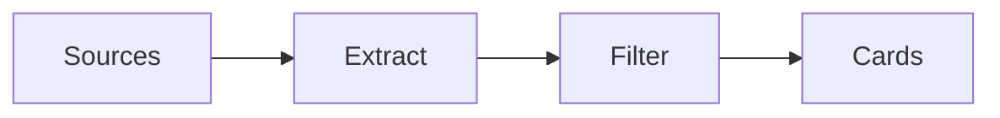

# README Design Guide

**Purpose:** Guide for creating and maintaining SpeakOps README files.

## README Philosophy

> **README is the landing page for the repository. Make it clear, professional, and actionable.**

## README Structure

### Required Sections

Every SpeakOps README should have:

1. **Title and tagline** — Clear identity
2. **Badges** — Status and metadata (optional)
3. **Short description** — What is this?
4. **Why it exists** — Problem statement
5. **Core loop** — How it works
6. **Architecture** — System overview
7. **Quick start** — Get started fast
8. **Repository structure** — What's where
9. **Development** — How to contribute
10. **License** — MIT for SpeakOps

### Optional Sections

Add if relevant:

- **Screenshots/diagrams** — Visual aids
- **Examples** — Sample usage
- **Roadmap** — Future plans
- **Contributing** — How to contribute
- **Changelog** — Recent changes
- **Acknowledgments** — Credits

## Content Guidelines

### Title and Tagline

**Good examples:**
```
# SpeakOps
Local-first Business English Voice Activation OS for IT/Product/AI professionals.
```

**Bad examples:**
```
# SpeakOps Project
An AI-powered language learning system with advanced features...
```

### Why It Exists

**Problem-focused:**
```
## Why SpeakOps Exists

IT/Product/AI professionals often have passive English vocabulary from reading,
but struggle to use it actively in spoken contexts like interviews, meetings,
and technical discussions.

SpeakOps bridges this gap through...
```

**Not:**
```
## About
SpeakOps is a revolutionary AI system that...
```

### Core Loop

**Visual and clear:**
```
## Core Loop

Sources → Extract → Filter → Cards → Voice Drill → Practice → Score → Replay → Weekly Eval
```

**Follow with explanation:**
```
**Sources:** Obsidian, Google Docs, YouTube, NotebookLM

1. **Ingest** source material
2. **Extract** Business English/IT/AI phrases
...
```

### Architecture

**High-level overview:**
```
## Architecture

SpeakOps is built as an **Agentic Development OS**:

- **Claude Code Skills** — Reusable voice and phrase workflows
- **Agents & Subagents** — Specialized reviewers and builders
- **Evals & Rubrics** — Quality gates for every behavior
...
```

**Include diagram if helpful:**
```mermaid
[diagram]
```

### Quick Start

**Actionable and simple:**
```bash
# 1. Ingest phrases
/ingest-obsidian --path "~/ObsidianVault/Phrases"

# 2. Extract and filter
/extract-phrases --domain stakeholder-pushback --level b2-c1
/filter-spoken

# 3. Build drill
/build-voice-drill --mode meeting --scenario stakeholder-pushback
```

**Follow with explanation of each step.**

### Repository Structure

**Clear tree view:**
```
speakops/
├── README.md
├── CLAUDE.md
├── skills/
├── agents/
├── evals/
...
```

**With inline comments:**
```
├── .claude/              # Claude Code integration
├── skills/               # Claude Code Skills
│   ├── phrase-extractor/
│   └── ...
```

## Writing Style

### Tone

**Professional but accessible:**
- Clear and direct
- Avoid hype
- Avoid buzzwords
- Be specific, not vague
- Use active voice

### ❌ Avoid

- "Revolutionary AI system"
- "Cutting-edge technology"
- "Groundbreaking approach"
- "World-changing solution"
- Hyperbolic claims

### ✅ Prefer

- "Local-first system"
- "Quality-focused approach"
- "Eval-driven development"
- "Privacy-first design"
- Specific capabilities

### Length

**Keep it focused:**
- README: 300–500 lines max
- Sections: Concise
- Examples: Short and clear
- Links: Provide for details

**When in doubt:**
- Create separate docs
- Link from README
- Keep README high-level

## Visual Elements

### Diagrams

**Use when helpful:**


**Keep diagrams simple:**
- Limited nodes
- Clear flow
- Readable text

### Badges

**Use sparingly:**
```markdown


```

**Only add if:**
- Provides useful information
- Not redundant
- Maintained

## Sections Best Practices

### Why It Exists

**Problem statement:**
- What problem does it solve?
- Who is it for?
- Why does it exist?

**Not:**
- Company history
- Philosophy
- Vision statements

### Quick Start

**Minimal working example:**
```bash
# Get started in 3 steps

git clone https://github.com/vstakhovsky/speak-ops
cd speakops
claude  # Start Claude Code in repo
```

**Not:**
- Comprehensive tutorial
- All options explained
- Advanced configuration

### Development

**Point to details:**
```markdown
## Development

See [CLAUDE.md](CLAUDE.md) for development process.

**Quality gates:**
- Unit tests if scripts changed
- Evals if skills/prompts changed
- Regression evals if scoring changed
```

**Not:**
- Full development guide
- All implementation details
- Duplicate of CLAUDE.md

## Common Mistakes

### Mistake 1: Too Long

❌ **Bad:** 1000+ line README
✅ **Good:** 300–500 lines, link to details

### Mistake 2: Too Vague

❌ **Bad:** "SpeakOps is an AI system for learning"
✅ **Good:** "SpeakOps is a local-first Business English Voice Activation OS for IT/Product/AI professionals"

### Mistake 3: Too Much Hype

❌ **Bad:** "Revolutionary AI-powered breakthrough platform"
✅ **Good:** "Local-first system with eval-driven development"

### Mistake 4: No Quick Start

❌ **Bad:** No getting started section
✅ **Good:** Clear 3-step quick start

### Mistake 5: Missing Key Information

❌ **Bad:** No architecture overview
✅ **Good:** High-level architecture with links

## README Quality Checklist

### Before Publishing

- [ ] Title and tagline clear
- [ ] Problem statement present
- [ ] Quick start actionable
- [ ] Architecture overview included
- [ ] Repository structure clear
- [ ] Links to detailed docs
- [ ] Development section points to CLAUDE.md
- [ ] License specified
- [ ] No hype or buzzwords
- [ ] Professional tone

### For Updates

- [ ] New features mentioned
- [ ] Quick start updated if needed
- [ ] Architecture updated if changed
- [ ] Changelog referenced
- [ ] Screenshots updated (if applicable)

## Examples

### Good README (SpeakOps)

Has:
- ✅ Clear title and tagline
- ✅ Problem statement
- ✅ Core loop visualization
- ✅ Architecture overview
- ✅ Quick start with commands
- ✅ Repository structure tree
- ✅ Development section
- ✅ Links to detailed docs
- ✅ License

### Bad README

Has:
- ❌ Vague title
- ❌ No problem statement
- ❌ No quick start
- ❌ All details in README (too long)
- ❌ Hype and buzzwords
- ❌ No structure overview
- ❌ No development guidance

## Maintenance

### When to Update README

- ✅ Major feature added
- ✅ Architecture changed
- ✅ New workflow added
- ✅ Quick start changed
- ✅ License changed

### When NOT to Update

- ❌ Minor documentation updates
- ❌ Typos fixed
- ❌ Small clarifications
- ❌ Eval tweaks
- ❌ Routine maintenance

---

**Guide Version:** 1.0
**Purpose:** Ensure consistent, high-quality README files
